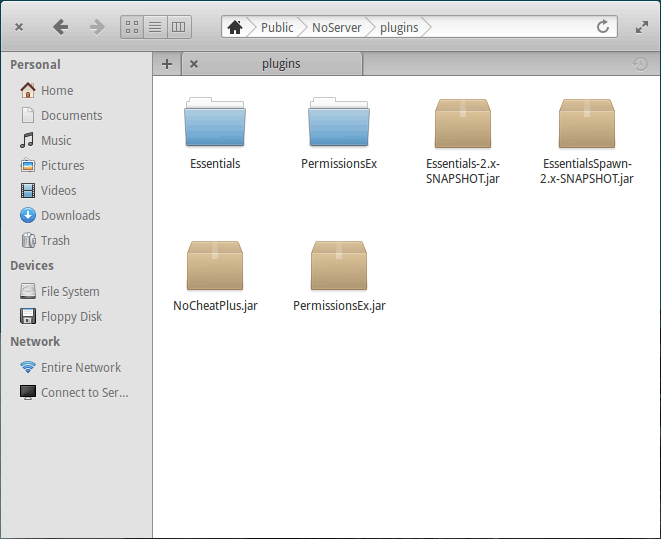

# Installation
1. Download NoCheatPlus from one of those 2 sources:
 * Release builds on [DBO]
 * Latest development build on [Jenkins]

2. Drop the NoCheatPlus.jar in your /plugins folder like this:    

3. Start-up your server

# Configuration
1. [Make other plugins compatible with NoCheatPlus](Compatibility)
2. Install ProtocolLib to enable the NET checks
3. [Setup permissions](Permissions)
4. [Learn what YAML is and how to edit it](YAML)
5. [Configure NoCheatPlus](Configuration)
6. [Study the Commands](Commands)

[DBO]:http://dev.bukkit.org/bukkit-plugins/nocheatplus/files/
[Jenkins]:http://ci.md-5.net/job/NoCheatPlus/lastSuccessfulBuild/artifact/target/NoCheatPlus.jar
[Compatibility]
