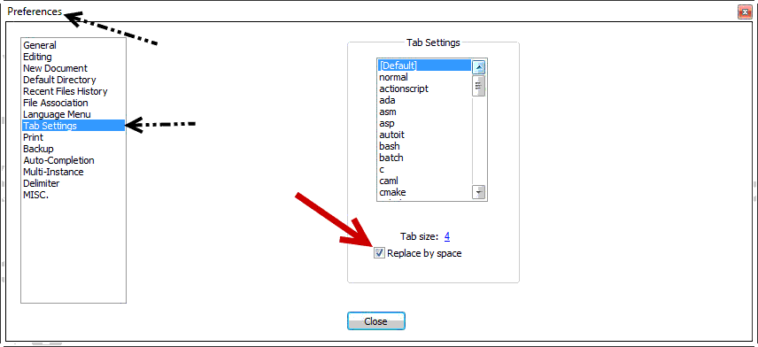

NoCheatPlus uses YAML for the configuration which stands for "**Y**et **A**nother **M**arkdown **L**anguage"

* Only use spaces and never tabs (for indentation).
* Keep the indentation level: Never change the amount of white-spaces in front of options in the config file "config.yml".
* Don't insert special characters. If you plan on complicated text entries, wrap them like '...' or "..." to be save.
* Always refer to the default config file for reference.
* You can use a [YAML Parser] to verify that your .yml is actually valid
* For those that use Notepad++ to edit their YAML files we recommend to enable "Replace by space" in Settings -> Preferences -> Tab Settings  
  

[YAML Parser]: http://yaml-online-parser.appspot.com/